# Taxi Booking Application (Uber-style interface) 🚕

A modern, responsive React-based taxi ride booking application with an Uber-inspired minimalist design. This full-featured application demonstrates professional React development practices, client-side routing, form validation, and clean UI/UX design.

## 📋 Table of Contents

- [Project Overview](#project-overview)
- [What This Project Does](#what-this-project-does)
- [Design Patterns Used](#design-patterns-used)
- [Tools & Technologies](#tools--technologies)
- [Features](#features)
- [Project Structure](#project-structure)
- [Application Flow](#application-flow)
- [Installation & Setup](#installation--setup)
- [How to Use](#how-to-use)
- [Available Scripts](#available-scripts)
- [Form Validation Details](#form-validation-details)
- [Contributing](#contributing)
- [License](#license)

## 🎯 Project Overview

**Book_A_Taxi** is a complete taxi ride booking service platform built with React. It provides users with an intuitive interface to browse taxi services, learn about the company, and book rides with advanced form validation. The application demonstrates real-world React development patterns including component composition, state management, form handling, and client-side routing.

### Target Users
- Passengers looking to book taxi rides
- Users interested in company information and services
- Developers learning React best practices

## 🔧 What This Project Does

The application provides the following functionality:

### Core Features

1. **Landing Page (Homepage)**
   - Hero section with call-to-action
   - Feature highlights showcasing company benefits
   - Statistics about the service
   - Direct booking button

2. **About Us Page**
   - Company mission and vision
   - Complete company history
   - Core values and principles
   - Team information

3. **Services Page**
   - 6 different taxi service types
   - Detailed pricing information
   - Service features and benefits
   - Additional service information

4. **Contact Page**
   - Contact information display
   - Validated contact form
   - Social media links
   - Real-time form validation with error messages

5. **Booking Page**
   - Comprehensive booking form
   - Advanced form validation:
     - Passenger name validation
     - Phone number validation
     - Location validation
     - Date and time validation (future dates only)
     - Service type selection
   - Success confirmation message
   - Booking information guidelines

6. **Navigation**
   - Sticky navigation bar on all pages
   - Professional taxi icon
   - Quick links to all sections
   - Responsive mobile navigation

## 🏗️ Design Patterns Used

### 1. **Component-Based Architecture**
```
Navigation (Reusable header component)
├── Navigation Menu
└── Logo with Icon

Pages (Route-specific components)
├── Home
├── About
├── Services
├── Contact
└── BookRide
```

### 2. **Functional Components with Hooks**
- **useState Hook**: Managing form state in Contact and BookRide pages
- **Form State Management**: Centralized form data handling
- **Error State Management**: Real-time validation feedback

### 3. **React Router (SPA Pattern)**
- Client-side routing without page reloads
- Nested route structure
- Link-based navigation
- BrowserRouter configuration

### 4. **Composition Pattern**
- Reusable Navigation component
- Reusable form groups
- Reusable card components

### 5. **Separation of Concerns**
- **Components folder**: Reusable UI components
- **Pages folder**: Full page components with business logic
- **Styles folder**: Modular CSS files per component/page

### 6. **Form Validation Pattern**
```javascript
// Controlled Components Pattern
const [formData, setFormData] = useState({
  field1: '',
  field2: ''
});

const [errors, setErrors] = useState({});

// Validation Logic
const validateForm = () => {
  const newErrors = {};
  // Validation rules...
  return newErrors;
};

// Form Submission
const handleSubmit = (e) => {
  e.preventDefault();
  const newErrors = validateForm();
  if (Object.keys(newErrors).length === 0) {
    // Submit form
  } else {
    setErrors(newErrors);
  }
};
```

### 7. **CSS Module Strategy**
- Separate CSS file per component
- Global styles in App.css and index.css
- CSS custom properties (CSS variables)
- Responsive design with media queries

## 🛠️ Tools & Technologies

### Core Framework
- **React 19.2.0** - UI library for building interactive components
- **React Router DOM 7.0.0** - Client-side routing and navigation
- **Vite 7.2.4** - Lightning-fast build tool and dev server

### Development Tools
- **ESLint** - Code quality and style checking
- **Mermaid** - Diagram visualization

### Build & Deployment
- **npm** - Package manager
- **Vite HMR** - Hot Module Replacement for instant feedback

### Design & Styling
- **CSS3** - Modern styling with flexbox, grid, and custom properties
- **Responsive Design** - Mobile-first approach

## ✨ Features

### UI/UX Features
- ✅ Clean, minimalist Uber-inspired design
- ✅ Fully responsive (mobile, tablet, desktop)
- ✅ Smooth transitions and hover effects
- ✅ Professional typography
- ✅ Consistent color scheme
- ✅ Accessible form inputs
- ✅ Error message display
- ✅ Success notifications

### Functional Features
- ✅ Multi-page navigation
- ✅ Advanced form validation
- ✅ Real-time error clearing
- ✅ Date/time validation (future dates only)
- ✅ Phone number format validation
- ✅ Email format validation
- ✅ Service type selection
- ✅ Form data persistence in component state

## 📁 Project Structure

```
BookTaxiProject/
├── src/
│   ├── assets/
│   │   └── taxi-icon.svg          # Custom taxi icon
│   │
│   ├── components/
│   │   └── Navigation.jsx         # Reusable navigation component
│   │
│   ├── pages/
│   │   ├── Home.jsx              # Homepage
│   │   ├── About.jsx             # About Us page
│   │   ├── Services.jsx          # Services listing
│   │   ├── Contact.jsx           # Contact form page
│   │   └── BookRide.jsx          # Booking form page
│   │
│   ├── styles/
│   │   ├── Navigation.css        # Navigation styling
│   │   ├── Home.css             # Homepage styling
│   │   ├── About.css            # About page styling
│   │   ├── Services.css         # Services page styling
│   │   ├── Contact.css          # Contact form styling
│   │   └── BookRide.css         # Booking form styling
│   │
│   ├── App.jsx                  # Main app component with routing
│   ├── App.css                  # Global app styles
│   ├── main.jsx                 # Entry point with BrowserRouter
│   └── index.css                # Global index styles
│
├── public/                       # Static assets
├── package.json                  # Dependencies and scripts
├── vite.config.js               # Vite configuration
├── eslint.config.js             # ESLint configuration
├── .gitignore                   # Git ignore rules
└── README.md                    # This file
```

## 🔄 Application Flow

### User Navigation Flow

```mermaid
graph TD
    A["🏠 User Visits Application"] --> B["Navigation Bar Loads"]
    B --> C{"User Selects Page"}
    
    C -->|Home| D["📍 Homepage"]
    D --> D1["View Features"]
    D --> D2["View Statistics"]
    D --> D3["Click Book Ride CTA"]
    
    C -->|About| E["ℹ️ About Us Page"]
    E --> E1["Read Company Info"]
    E --> E2["View Core Values"]
    
    C -->|Services| F["🚕 Services Page"]
    F --> F1["Browse Service Types"]
    F --> F2["View Pricing"]
    
    C -->|Contact| G["📧 Contact Page"]
    G --> G1["View Contact Info"]
    G --> G2["Fill Contact Form"]
    G2 --> G3{"Form Valid?"}
    G3 -->|Invalid| G4["Show Errors"]
    G4 --> G2
    G3 -->|Valid| G5["Show Success"]
    
    C -->|Book a Ride| H["🎫 Booking Page"]
    H --> H1["Fill Booking Form"]
    H1 --> H2{"Validation Check"}
    H2 -->|Invalid| H3["Display Errors"]
    H3 --> H1
    H2 -->|Valid| H4["Show Confirmation"]
    H4 --> H5["Reset Form"]
    
    D3 --> H
```



### Form Validation Flow


### Component Hierarchy


## 🚀 Installation & Setup

### Prerequisites
- Node.js (v16 or higher)
- npm or yarn package manager

### Step 1: Clone or Download
```bash
cd BookTaxiProject
```

### Step 2: Install Dependencies
```bash
npm install
```

This installs:
- React and React DOM
- React Router DOM
- Vite and its plugins
- ESLint and development tools

### Step 3: Start Development Server
```bash
npm run dev
```

The application will be available at `http://localhost:5173/`

### Step 4: Build for Production
```bash
npm run build
```

Creates optimized production build in the `dist/` folder.

### Step 5: Preview Production Build
```bash
npm run preview
```

Preview the production build locally.

## 📖 How to Use

### Navigating the Application

1. **Home Page**
   - Click "Book a Ride" button for quick booking
   - Explore company features and statistics

2. **About Us**
   - Learn about company mission and values
   - Understand company history

3. **Services**
   - Compare different taxi service types
   - Check pricing and features

4. **Contact**
   - View contact information
   - Send a message using the contact form

5. **Book a Ride**
   - Enter passenger information
   - Select pickup and drop-off locations
   - Choose date, time, and service type
   - Submit booking with instant validation

### Form Validation in Action

**Contact Form:**
- All fields are required
- Email must be valid format (example@domain.com)
- Phone must have at least 10 digits
- Error messages appear immediately below invalid fields
- Errors clear as you type

**Booking Form:**
- Passenger name must be minimum 2 characters
- Phone validation for international formats
- Pickup and drop-off must be different
- Date must be today or in the future
- Time must be in the future (today's bookings only)
- Service type selection is required

## 💻 Available Scripts

```bash
# Start development server with HMR
npm run dev

# Build for production
npm run build

# Preview production build
npm run preview

# Run ESLint code quality check
npm run lint
```

## ✅ Form Validation Details

### Contact Form Validation Rules
| Field | Rules | Example |
|-------|-------|---------|
| Name | Required, text only | John Doe |
| Email | Required, valid email format | john@example.com |
| Phone | Required, 10+ digits | (555) 123-4567 |
| Subject | Required, text | Inquiry about services |
| Message | Required, text | Your message here... |

### Booking Form Validation Rules
| Field | Rules | Example |
|-------|-------|---------|
| Passenger Name | Required, 2+ characters | Jane Smith |
| Contact Number | Required, 10+ digits | 9876543210 |
| Pickup Location | Required, different from dropoff | 123 Main Street |
| Drop-off Location | Required, different from pickup | 456 Oak Avenue |
| Date | Required, today or future | 2026-02-10 |
| Time | Required, future time | 14:30 |
| Service Type | Required selection | Economy, Premium, etc. |

## 🎨 Design System

### Color Palette (Uber-Inspired)
- **Primary**: #000000 (Black)
- **Secondary**: #222222 (Dark Gray)
- **Background**: #FFFFFF (White)
- **Light BG**: #F5F5F5 (Light Gray)
- **Text**: #333333 (Dark Gray)
- **Borders**: #F0F0F0 (Very Light Gray)

### Typography
- **Font Family**: System fonts (-apple-system, BlinkMacSystemFont, Segoe UI, Roboto)
- **Heading Weight**: 600-700
- **Body Weight**: 400-500

### Spacing System
- Base unit: 0.5rem (8px)
- Padding/Margin: 0.5rem, 1rem, 1.5rem, 2rem, 3rem, 4rem

## 🔍 Browser Support

- Chrome (latest)
- Firefox (latest)
- Safari (latest)
- Edge (latest)
- Mobile browsers (iOS Safari, Chrome Mobile)

## 📚 Learning Outcomes

This project demonstrates:
- ✅ React Hooks (useState) for state management
- ✅ React Router for SPA navigation
- ✅ Form handling and validation
- ✅ Component composition and reusability
- ✅ CSS styling and responsive design
- ✅ Event handling and form submission
- ✅ Conditional rendering
- ✅ Props usage and data flow
- ✅ Professional code structure
- ✅ Git version control basics

## 🤝 Contributing

This is an educational project. Feel free to:
- Fork the repository
- Create feature branches
- Submit pull requests
- Report issues